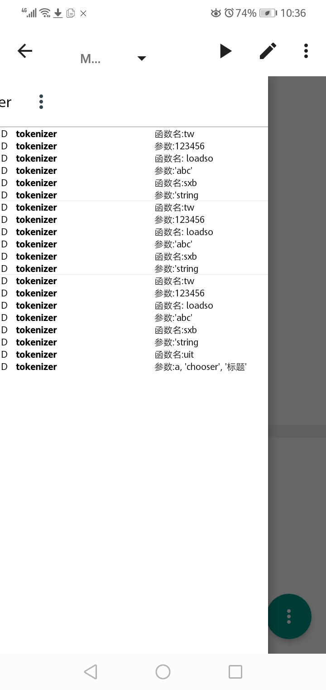

# oiapp

#### 介绍
开源iapp实现，禁止修改后用于商业用途，但是和GNU gcc一样，可以使用该软件产品制作编译自己的软件

#### 软件架构
软件架构说明 安卓java

### 软件开发中的截图

#### 安装教程

1.  gradle build
2.  安装运行

#### 使用说明

1.  无
#### 参与贡献

1.  Fork 本仓库
2.  新建 Feat_xxx 分支
3.  提交代码
4.  新建 Pull Request

#### 特技

1.  无
